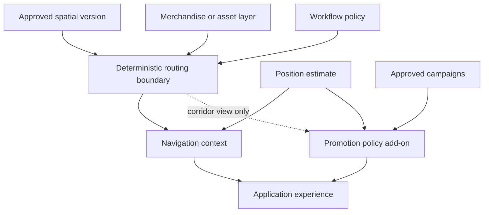

# Public architecture

## System thesis

Cortex Spatial Intelligence separates five kinds of authority:

1. **Authoritative spatial truth** — an approved, immutable map version and traversable graph.
2. **Dynamic merchandise or asset truth** — SKU or asset destinations maintained separately from the physical map.
3. **Workflow policy** — customer, fulfillment-picker, and stocker modes with explicit defaults and restrictions.
4. **Positioning observations** — estimates supplied through an adapter boundary rather than embedded in routing.
5. **Optional promotions policy** — campaign eligibility and ranking that can observe route context but cannot own or mutate a route.

The promotions add-on receives only the bounded context required to make a display decision. Payment cannot turn promotional inventory into ownership of the route.

## Observable workflow contracts

### Shopper and fulfillment picker

Input categories:

- request and workflow identifier;
- map and merchandise version references;
- start and end nodes;
- requested SKUs or assets;
- allowed constraints and overlays.

Observable result categories:

- ordered stops;
- full graph legs and path;
- total distance;
- map/version evidence;
- deterministic ordering evidence;
- warnings and input errors.

### Stocking and replenishment

Additional inputs:

- receiving or staging-bay node;
- quantities or case counts;
- `closest-first` or `farthest-first` sequence;
- optional ending node.

Observable behavior:

- rank destinations by shortest traversable path distance from the selected bay;
- use destination node, SKU, and original request position as stable tie-breakers;
- group shared destinations without erasing line identity or quantity;
- reconstruct legal paths through the chosen order without changing that order.

### Governed proximity promotions

Observable eligibility requires:

- approved and active lifecycle state;
- explicit evaluation timestamp within the effective period;
- valid store/location scope;
- authoritative merchandise destination;
- proximity and route-corridor relevance;
- required sponsorship disclosure;
- applicable preference, restriction, and frequency permission.

Observable result categories:

- ordered eligible promotion decisions;
- suppressed decisions with reason codes;
- disclosure and ranking evidence;
- route-protection assertions;
- no replacement route.

## What the public reference omits

The public architecture is intentionally abstract. It does not disclose the production engine's source layout, internal data structures, optimization implementation, policy enforcement code, provider integrations, customer adapters, production evidence system, performance tuning, or deployment topology.

